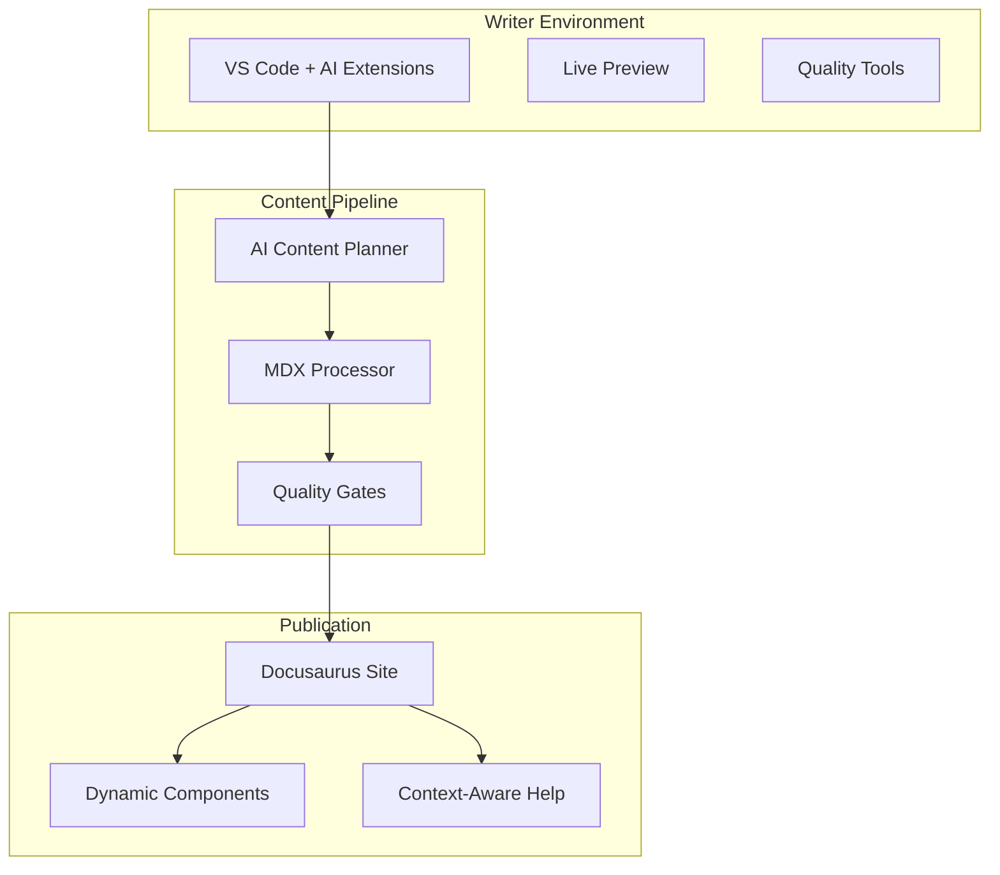

# AI-Centric Docs-as-Code POC

Welcome to the **AI-Centric Docs-as-Code POC** - a demonstration of how artificial intelligence can transform technical documentation workflows.

## What This POC Demonstrates

This proof of concept showcases a complete documentation ecosystem that integrates AI assistance at every level:

### 🤖 AI-Enhanced Writing Experience
- **Intelligent Content Planning**: AI analyzes feature requirements and generates comprehensive documentation plans
- **Context-Aware Assistance**: AI understands your product domain and provides relevant suggestions
- **Automated Content Generation**: Generate drafts, outlines, and boilerplate content based on existing patterns

### 📝 Modern Writing Environment
- **VS Code Integration**: Fully configured environment with extensions optimized for technical writing
- **Live Preview**: Real-time rendering with hot reloading for immediate feedback
- **Quality Automation**: Automated spell checking, linting, and style enforcement

### 🔄 Dynamic Content Capabilities
- **Data-Driven Components**: Tables and content that update automatically from YAML sources
- **Interactive Elements**: Expandable sections, filterable content, and dynamic navigation
- **Version Management**: Seamless handling of multiple product versions and releases

### 🚀 Automated Workflows
- **CI/CD Integration**: Automated testing, quality checks, and deployment
- **Batch Operations**: AI-powered bulk content improvements and metadata management
- **Quality Gates**: Prevent publication of content that doesn't meet standards

## Key Benefits

### For Writers
- **Reduced Cognitive Load**: AI handles routine tasks, letting writers focus on user experience
- **Faster Content Creation**: Generate comprehensive documentation plans and drafts quickly
- **Consistent Quality**: Automated style checking and content validation

### For Teams
- **Scalable Workflows**: Handle large documentation sets efficiently
- **Collaborative Features**: Seamless integration with Git workflows and review processes
- **Knowledge Preservation**: AI learns from existing content patterns and maintains consistency

### For Users
- **Context-Aware Help**: Documentation that adapts based on user role and current task
- **Always Up-to-Date**: Dynamic content ensures information stays current
- **Better Discoverability**: AI-optimized metadata improves search and navigation

## Getting Started

Ready to explore the future of documentation? Start with our [installation guide](./getting-started/installation) to set up your environment.

## Architecture Overview

This POC represents a complete reimagining of how technical documentation can be created, maintained, and consumed in the age of AI.
